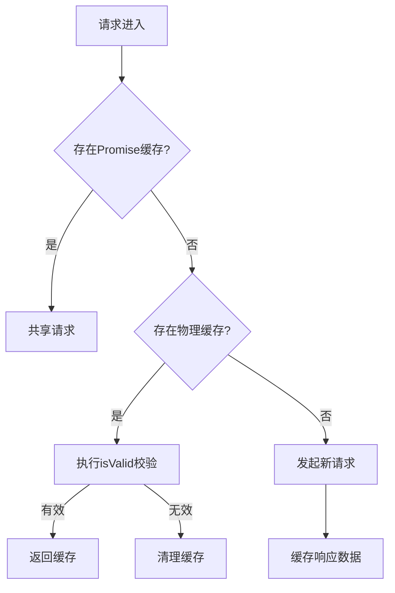
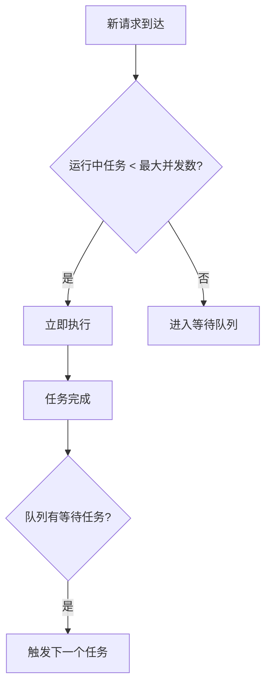

---

# @net-vert/core

**轻量级依赖倒置网络请求库，专为扩展和易用而设计。**

GitHub 开源仓库 👉 [https://github.com/yvygyyth/net-vert](https://github.com/yvygyyth/net-vert)

---

## ✨ 核心特性

✅ 解耦网络层，按需注入 axios、fetch 或自定义请求器  
✅ 支持缓存、幂等、重试等扩展  
✅ TypeScript 全类型提示，开发更丝滑  
✅ 内置幂等、缓存、重试等扩展
✅ 零配置上手，API 极简  

---

## 📦 安装

```bash
npm install @net-vert/core
```

---

## 🚀 快速上手

### 1️⃣ 注入请求器（以 axios 为例）

```typescript
import axios from 'axios';
import { inject, useRequestor } from '@net-vert/core';

const instance = axios.create({ baseURL: '/api', timeout: 60000 });
const axiosAdapter = (config) => instance.request(config);

inject(axiosAdapter); // 注入 axios 实例
```

---

### 2️⃣ 发起请求

```typescript
const api = useRequestor();

api.get('/user/info', { params: { id: 1 } }).then(console.log);
api.post('/user/create', { name: 'Alice' }).then(console.log);
```

---

## 🛠 扩展能力（requestExtender）

```typescript
import { requestExtender } from '@net-vert/core';
```

✅ **缓存请求**
```typescript
const cachedApi = requestExtender.cacheRequestor();
cachedApi.get('/user/info', { params: { id: 1 } });
```

✅ **幂等请求**
```typescript
const idempotentApi = requestExtender.idempotencyRequestor();
idempotentApi.post('/user/create', { name: 'Alice' });
```

✅ **自动重试**
```typescript
const retryApi = requestExtender.retryRequestor({ retries: 3, delay: 1000 });
retryApi.get('/unstable-api');
```

---

## 🔎 缓存设计说明

- 本库默认内置缓存支持
- **后续将完全依赖官方独立包：`@net-vert/cache`**
- 用户无需关注存储机制，专注请求本身

---

## 🧩 核心 API

| 方法 | 描述 |
|-----|------|
| `inject(adapter, instanceKey?)` | 注入请求适配器,不填默认为'default' |
| `useRequestor(instanceKey?)` | 获取请求实例 |
| `requestExtender.cacheRequestor(options)` | 创建带缓存能力的请求器 |
| `requestExtender.idempotencyRequestor(options)` | 创建幂等请求器 |
| `requestExtender.retryRequestor(options)` | 创建重试请求器 |

非常专业！以下是针对你这份缓存扩展的专属文档（带源码思路和示例）：  

---

## 🗂 缓存扩展 `requestExtender.cacheRequestor(options)`

`cacheRequestor` 是 `@net-vert/core` 内置的智能缓存增强器，提供多维度缓存控制能力，支持同步/异步校验策略。

### ✅ 核心特性

- **🚀 多级缓存策略**  
  内存缓存 + 持久化存储（未来由 `@net-vert/cache` 提供）
  
- **🔗 智能并发合并**  
  相同请求共享 Promise，避免重复网络消耗

- **⏳ 动态缓存控制**  
  支持时间/逻辑双重失效校验机制

- **🧩 弹性校验策略**  
  支持同步/异步缓存有效性检查

---

### ⚙️ 配置参数

| 参数         | 类型                                                                 | 说明                                                          | 默认值         |
|--------------|--------------------------------------------------------------------|-------------------------------------------------------------|----------------|
| `key`        | `(config: UnifiedConfig) => string`                               | 自定义缓存键生成规则                                         | `config.url`   |
| `persist`    | `boolean`                                                         | 启用持久化存储（默认内存存储）                                | `false`        |
| `duration`   | `number` 或 `({ key, config, response }) => number`               | 缓存时间（ms）或动态计算函数                                  | `Infinity`     |
| `isValid`    | `({ key, config, cachedData }) => boolean \| Promise<boolean>`    | 缓存有效性校验（支持异步校验）                                | -              |

---

### 📥 基础使用

```typescript
import { requestExtender } from '@net-vert/core';

const api = requestExtender.cacheRequestor({
  duration: 3000, // 缓存3秒
  key: config => `${config.method}:${config.url}` // 复合键
});

// 首次请求将缓存
api.get('/user').then(console.log); 

// 3秒内相同请求直接返回缓存
api.get('/user').then(console.log); 
```

### 🎯 动态缓存示例

#### 根据响应数据设置缓存时间
```typescript
requestExtender.cacheRequestor({
  duration: ({ response }) => response.data.isHot ? 10000 : 3000
});
```

#### 权限变更时失效缓存
```typescript
requestExtender.cacheRequestor({
  isValid: ({ cachedData }) => {
    return cachedData.value.permission === currentUser.permission
  }
});
```

#### 异步校验缓存有效性
```typescript
requestExtender.cacheRequestor({
  async isValid({ key }) {
    const { valid } = await fetch('/cache/validate', { body: key })
    return valid
  }
});
```

---

### 🛠 工作机制



---

### ⚠️ 注意事项

1. **缓存穿透防护**  
   当 `isValid` 返回 `false` 时会主动清理缓存，后续请求将触发新请求

2. **异步校验建议**  
   耗时较长的异步校验建议配合 `duration` 使用，避免校验期间重复请求

3. **内存管理**  
   高频数据建议启用 `persist` 持久化存储，防止内存溢出
```

```

## ♻️ 幂等扩展 `requestExtender.idempotencyRequestor(options)`

`idempotencyRequestor` 是基于 `cacheRequestor` 封装的幂等增强器，确保同一参数的请求，在请求未完成前只发送一次，自动合并并发请求，避免重复提交和资源浪费。

---

### ✅ 核心特性

- 采用 **哈希生成请求唯一标识**，自动识别重复请求
- 请求未完成时直接复用 Promise，避免短时间内重复请求接口
- 请求完成自动清理，确保后续请求正常发起
- 内存缓存（`persist: false`），适合表单提交、按钮防抖等场景

---

### ⚙️ 内部默认的哈希算法（hashRequest）

```typescript
const hashRequest = (config: UnifiedConfig) => {
  const { method, url, params, data } = config
  return [method, url, JSON.stringify(params), JSON.stringify(data)].join('|')
}
```
支持用户传入自定义生成规则：

```typescript
const idempotentApi = requestExtender.idempotencyRequestor((config) => {
  return `custom-key-${config.url}`;
});
```

---

## 🔁 重试扩展 `requestExtender.retryRequestor(options)`

`retryRequestor` 是基于 `Requestor` 增强的请求重试器，提供自动重试机制，确保请求失败时自动重试，提升请求稳定性。

---

### ✅ 核心特性

- 支持 **最大重试次数**，可避免无限重试
- 支持 **延迟重试**，延迟时间可自定义，默认 1000ms
- 支持 **重试条件**，根据特定错误判断是否重试
- 自动处理请求失败，符合幂等性原则，保证稳定性

---

### ⚙️ 配置选项

| 参数              | 类型                                       | 说明                                             | 默认值       |
| ----------------- | ------------------------------------------ | ------------------------------------------------ | ------------ |
| `retries`         | `number`                                   | 最大重试次数                                     | `3`          |
| `delay`           | `number` 或 `({attempt: number}) => number` | 延迟重试时间（默认延迟 1000ms）                  | `1000ms`     |
| `retryCondition`  | `(error: any) => boolean`                  | 重试条件，返回 `true` 时触发重试（默认对所有错误重试） | `() => true`  |

---

### 📥 使用示例

```typescript
import { requestExtender } from '@net-vert/core';

// 配置最大重试次数为 5 次，延迟 2 秒
const retryApi = requestExtender.retryRequestor({
  retries: 5,
  delay: 2000
});

// 请求失败时自动重试
retryApi.get('/unstable-api').then(console.log).catch(console.error);
```

---

### 🔎 重试逻辑解析

1. **最大重试次数 (`retries`)**：当请求失败时，最多重试 `retries` 次。
2. **延迟策略 (`delay`)**：每次重试之间等待一段时间，支持固定时间或动态计算。
   - 默认：1000ms（1秒）
   - 可以根据重试次数动态调整延迟时间：
     ```typescript
     delay: (attempt) => attempt * 1000 // 每次重试延迟递增
     ```
3. **重试条件 (`retryCondition`)**：只有当错误符合重试条件时才会进行重试，默认为所有错误都重试。

---

### ⚠️ 使用建议

- **避免无限重试**：设置合适的最大重试次数（`retries`）和延迟时间（`delay`），防止请求卡死。
- **根据错误类型重试**：可以根据特定的错误类型或者状态码设定 `retryCondition`，例如：
  ```typescript
  retryCondition: (error) => error.response.status === 500
  ```
  这样仅在服务器错误时才会进行重试。

---

### 🔥 典型应用场景

- **API 请求失败重试**：对那些偶尔会失败的网络请求，提供自动重试能力，提升成功率。
- **避免因瞬时网络问题而导致的请求失败**。
- **服务宕机恢复后自动重新发起请求**。

---

### 📥 使用示例

```typescript
import { requestExtender } from '@net-vert/core';

const idempotentApi = requestExtender.idempotencyRequestor();

// 短时间内连续点击两次，只会发出一次请求
idempotentApi.post('/user/create', { name: 'Alice' }).then(console.log);
idempotentApi.post('/user/create', { name: 'Alice' }).then(console.log);
```

控制台：
```
===> 已存在该请求: POST|/user/create|{}|{"name":"Alice"}
```

---

### 🔎 典型应用场景

✅ 表单防重复提交  
✅ 提交按钮多次点击防抖  
✅ 防止接口雪崩（接口短时间被高频调用）

---

### ⚠️ 使用注意

- 本功能专为短时防重复设计，**缓存不持久化**
- 推荐用于 POST、PUT 等存在副作用的接口
- 自动清理缓存，确保下一次请求正常发出

---

```markdown
# 🚀 并发请求控制器 `createConcurrentPoolRequestor`

提供智能并发控制与自动重试能力的请求扩展器，适用于需要精准控制请求并发的场景。

---

## 📦 核心模块

### 1. 并发池 `ConcurrentPool`
```typescript
export class ConcurrentPool {
    parallelCount: number      // 最大并行任务数
    tasks: TaskItemList        // 待执行任务队列
    runningCount: number       // 当前运行中任务数
    
    constructor(parallelCount = 4)  // 初始化并发池
    
    // 添加任务到队列
    add(id: string, task: Task): Promise<any>
    
    // 移除指定任务
    remove(id: string): void
    
    // 执行单个任务（内部方法）
    private execute(currentTask: TaskItem): void
    
    // 启动任务处理（内部调度器）
    private _run(): void
}
```

---

### 2. 请求器工厂函数
```typescript
createConcurrentPoolRequestor(config): {
    requestor: Requestor,     // 增强后的请求器实例
    concurrentPool: ConcurrentPool // 关联的并发池
}
```

---

## ⚙️ 配置参数

| 参数             | 类型                                   | 说明                           | 默认值               |
|------------------|---------------------------------------|------------------------------|---------------------|
| `parallelCount`  | `number`                              | 最大并行请求数                  | 4                   |
| `createId`       | `(config: UnifiedConfig) => string`   | 生成唯一任务ID的函数            | 时间戳+随机数        |
| `retries`        | `number`                              | 失败重试次数                   | 0 (不重试)          |

---

## 🎯 功能特性

### 1. 智能并发控制


### 2. 自动重试机制
```typescript
// 集成重试模块的工作流
sequenceDiagram
    participant P as 并发池
    participant R as 重试模块
    participant S as 服务器
    
    P->>R: 执行请求
    R->>S: 尝试请求
    alt 成功
        S-->>R: 返回数据
        R-->>P: 传递结果
    else 失败
        R->>R: 重试逻辑(最多retries次)
        R-->>P: 最终结果/错误
    end
```

---

## 📝 使用示例

### 基础使用
```typescript
import createConcurrentPoolRequestor from '@/requests/modules/concurrentPoolRequestor'

// 创建最大并发数为3的请求器
const { requestor } = createConcurrentPoolRequestor({
    parallelCount: 3,
    retries: 2, // 失败自动重试2次
    delay: 500  // 重试间隔500ms
})

// 批量发起请求
const requests = Array(10).fill(0).map(() => 
    requestor.get('/api/data')
)

Promise.all(requests).then(results => {
    console.log('所有请求完成:', results)
})
```

### 高级控制
```typescript
// 获取并发池实例进行精细控制
const { requestor, concurrentPool } = createConcurrentPoolRequestor()

// 动态调整并发数
concurrentPool.parallelCount = 5 

// 取消特定请求
const reqId = 'custom-id-123'
requestor.post('/api/submit', { data }, {
    __id: reqId // 通过配置注入自定义ID
}).catch(err => {
    if (err.message === 'ABORTED') {
        console.log('请求被主动取消')
    }
})

// 主动取消任务
concurrentPool.remove(reqId)
```

---

## ⚠️ 注意事项

1. **ID生成策略**  
   确保`createId`函数生成的ID具有唯一性：
   ```typescript
   createId: config => `${config.method}:${config.url}:${hash(config.params)}`
   ```

2. **资源释放**  
   长时间运行的实例需手动释放资源：
   ```typescript
   // 清空任务队列
   concurrentPool.tasks.clear() 
   ```

---

## 🛠 设计理念

### 1. 队列优先级策略
```typescript
// 可扩展为优先级队列
interface PriorityTaskItem extends TaskItem {
    priority: number
}

// 自定义队列实现
class PriorityQueue implements TaskItemList {
    enqueue(id: string, item: PriorityTaskItem) {
        // 根据优先级插入队列
    }
}
```

## 📤 开源信息

- 仓库地址：[https://github.com/yvygyyth/net-vert](https://github.com/yvygyyth/net-vert)
- 许可证：MIT
- 支持 Tree-Shaking
- 无副作用 (`sideEffects: false`)

---

## 🔥 设计理念

- 网络层完全解耦，未来自由扩展
- 内置强大的请求能力，零上手成本
- 存储与缓存拆分，保持核心轻量纯粹

---

如果你确定了包名是 `@net-vert/cache`，我可以直接帮你生成一段未来文档里的“缓存插件使用示例”，随时告诉我！